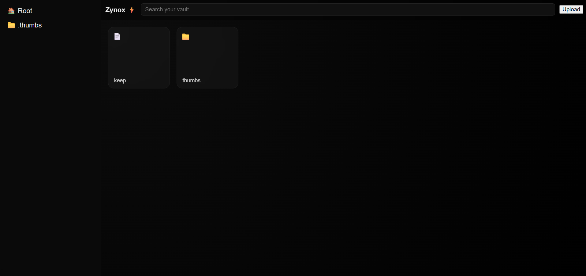
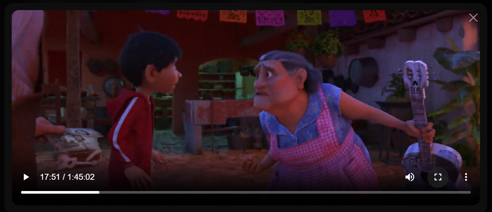

# Zynox


**Local-first file sharing and media streaming — accessible from any device on your network.**  
No accounts. No cloud. No internet. Just run it and open a browser.

---

## 🤔 Why Zynox?

Most tools focus on either file storage or media streaming.

Zynox does both, locally, with zero configuration. It started as a personal fix for moving files between devices without touching the cloud.

---

## ✨ Features

| Feature | Details |
|---|---|
| 🎬 Media Streaming | Stream video and audio directly in the browser — no downloads |
| 🗂 File Explorer | Grid view, sidebar, and hover video previews |
| 📤 Drag & Drop Upload | Drop files anywhere in the window |
| 🔍 Smart Search | Filter by type — try `"videos"`, `"images"`, `"pdf"` |
| 🖱 Context Menu | Right-click for quick actions |
| ⌨️ Keyboard Shortcuts | `Enter` to open, `Delete` to remove |
| ♾️ Virtual Scrolling | Handles large folders without slowdown |
| 📱 PWA Support | Install on your phone like a native app |
| 💻 Responsive | Works on desktop and mobile |

---

## ⚙️ How It Works

Flask serves the backend — endpoints for directory listing, uploads, and media streaming.

Streaming uses **HTTP range requests**, so scrubbing and seeking work without reloading the whole file.

The frontend is plain HTML, CSS, and JS. No frameworks. Everything is rendered client-side via `fetch`.

FFmpeg is optional — when present, it generates video thumbnails. Otherwise, files fall back to a generic preview.

---

## 🏗 Architecture

```
Browser (HTML/CSS/JS)
    │
    ├── GET  /files         → list directory contents
    ├── POST /upload        → handle drag-and-drop uploads
    ├── GET  /stream/<file> → serve media via HTTP range requests
    └── GET  /thumbnail     → FFmpeg-generated preview (optional)

Flask Backend
    └── serves files directly from a configured root directory
```

No database. No ORM. Just the filesystem. Thumbnails are generated once and cached.

- Designed to stay minimal — no unnecessary layers or hidden complexity
---

## 📁 Project Structure

```
zynox/
├── server.py          # Flask app — all backend logic
├── requirements.txt   # Python dependencies
├── static/
│   ├── css/           # Styles
│   ├── js/            # Frontend logic
│   └── icons/         # UI icons
├── templates/
│   └── index.html     # Main UI template
└── assets/            # Screenshots (for README)
```

---

## 🚀 Setup

**Requirements:** Python 3.8+, pip  
**Optional:** FFmpeg (for video thumbnails)

```bash
git clone https://github.com/Garv-Tech/zynox-filehub.git
cd zynox-filehub
pip install -r requirements.txt
python server.py
```

Open in your browser:

```
http://localhost:5000
```

To access from another device on the same network:

```
http://<your-local-ip>:5000
```

**Find your local IP**

```bash
ip a        # Linux/macOS (or: ifconfig)
ipconfig    # Windows
```

---

## 🖥 Usage

1. Open the app from any device on the same network
2. Click folders to navigate, click files to stream
3. Drag and drop files anywhere to upload
4. Right-click for download, delete, and other actions
5. Use search to filter by name or type (`"video"`, `"pdf"`, `"music"`)
6. On mobile — add to home screen via the share icon for a cleaner experience

Streaming works for any format your browser supports natively (MP4, WebM, MP3, etc.).

> First time? Upload a video and open it from your phone — that’s the fastest way to see what Zynox does.
---

## 📸 Screenshots



-->

---

## ⚠️ Limitations

- **No authentication** — anyone on your LAN can access it. Don't use this on public networks.
- **Codec support** — playback depends on what your browser supports natively.
- **Thumbnails** — require FFmpeg; takes a moment on first run for new files.
- **Scale** — personal/home use only, not built for multi-user deployments.
- **No sync or versioning** — it's a file server, not a backup tool.

---

## 🗺 Planned Improvements

- [ ] Optional password protection
- [ ] Transcoding fallback for unsupported formats
- [ ] Download folders as `.zip`
- [ ] File sorting (date, size, type)
- [ ] Persistent UI preferences (theme, layout)

---

## 🤝 Contributing

Contributions are welcome — small ones included. The codebase is straightforward, so it's a good place to start if you're new to open source.

**Workflow:** fork → branch → commit → PR

```bash
git checkout -b fix/your-fix-name
# make changes
git commit -m "fix: what you changed"
git push origin fix/your-fix-name
```

Bug fixes, UI tweaks, docs, performance — all fair game. Not sure if something's worth a PR? Open an issue first.

You don’t need permission to improve something — if you see it, fix it.

---

## 📄 License

MIT — do what you want, just keep the attribution.

---

## 👤 Author

Built by **Garv**. Started as a personal fix. Grew from there.

---

<p align="center">
  <sub>If Zynox saves you time, a ⭐ on GitHub goes a long way.</sub>
</p>